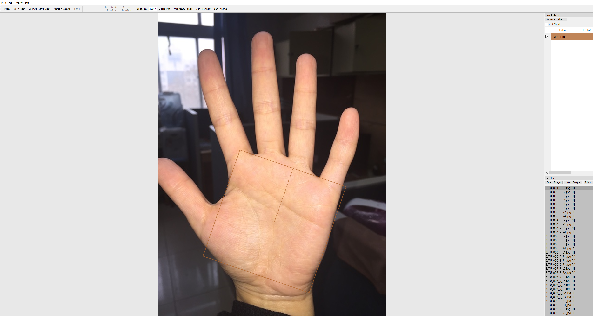
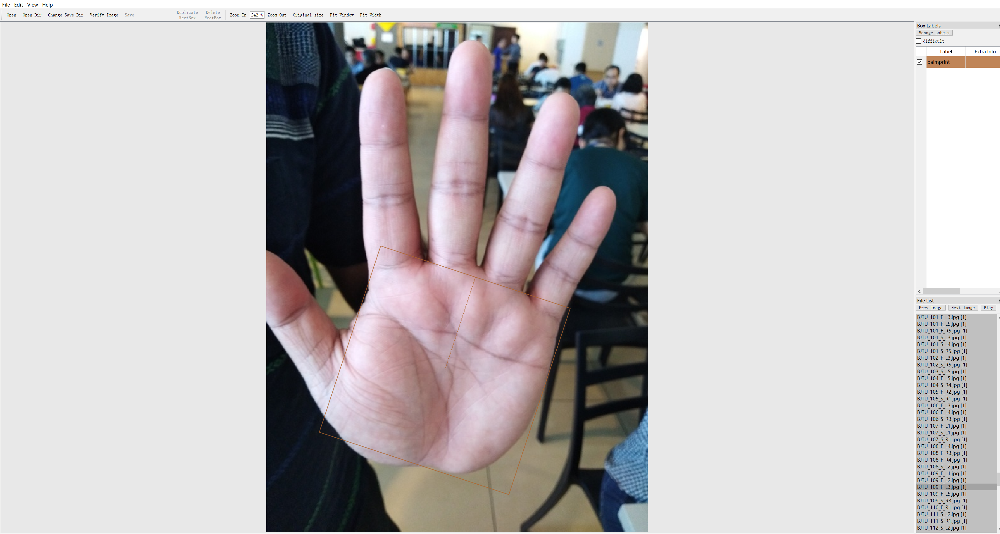
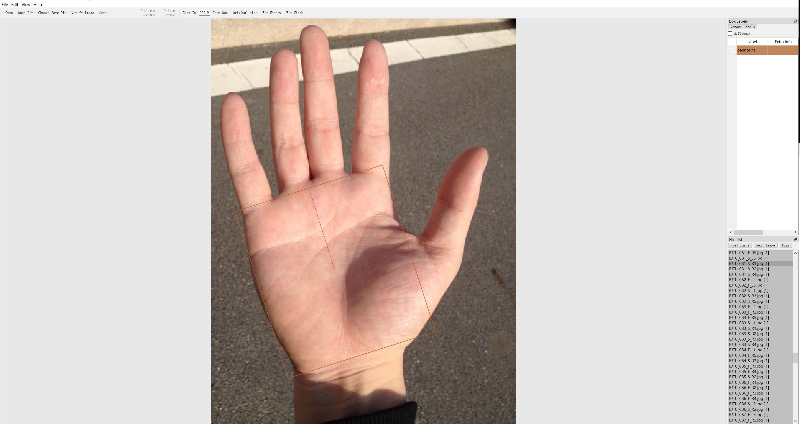
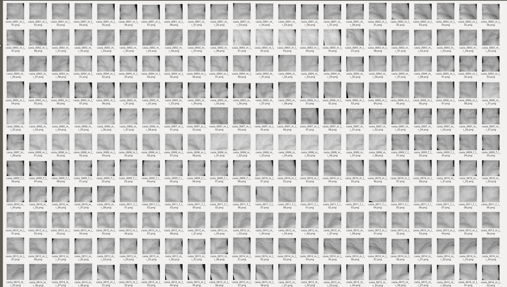

# CROI
detector for rotated-object based on CenterNet

## Palmprint CROI annotation
* We use the labeling tool [Labelmg](https://github.com/chinakook/labelImg2/) to get the label palmprint CROI 
* When labeling, try to align the CROI box with your palm as much as possible. Here are some examples:
  * 
  * 
  * 
* After labeling, we get the label files (.xml) of the palmprint CROI. Then we put these label files in the path: ./labelGenerator/label/
* Then use (trans.py) to assign the training labels and validation labels in label, and use (voc2coco.py) to convert these label files into a (train.json) and a (val.json).
* Through the above operations, the label preparation work for Palmprint CROI is completed.

## Palmprint CROI extractor
We use a modified Centeret as the palmprint CROI extractor. The source code comes from:https://github.com/ZeroE04/R-CenterNet
### Training
* First, we put the labeled train.json and val.json label files into the path: ./data/palmprint/annotations/. 
* At the same time, put the palmprint images corresponding to these tags to the path: ./data/palmprint/images/
* Open the (train.py) file, set the names of backbone, epoch, batch_size and network weights and then run (train.py) for training.
### The CROI extraction from unseen palmprint images
* Open (predict.py), set the path to load the weight file and save the CROI, and then run (predict.py) for palmprint CROI extraction.
* Under the path where the CROI is saved, the CROI of the xx data set is extracted to the xx folder, for example:
  * CAISA 
  * IITD 
  * XJTU-UP 
  * MPD 
  * BJTU 
* At the same time, palmprint images that fail to be extracted will be placed in the fail_images folder.
